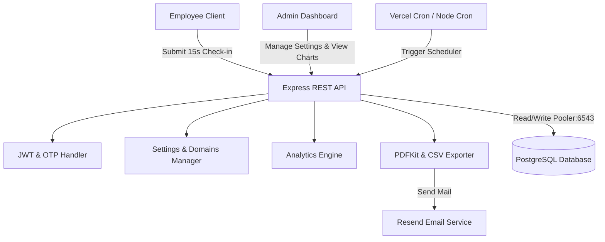

# AuraWell: Employee Mood and Wellbeing Index

[Vercel Deployment](https://vercel.com) | [TypeScript](https://www.typescriptlang.org/) | [React](https://react.dev/) | [TailwindCSS](https://tailwindcss.com/) | [PostgreSQL](https://www.postgresql.org/) | [License: MIT](https://opensource.org/licenses/MIT)

AuraWell is a production-ready, full-stack application designed to capture employee emotional check-ins in under 15 seconds while delivering robust, granular, and actionable wellbeing insights to organization administrators.

---

## Key Features

*   **15-Second Mood Check-in**: A lightweight, mobile-first workflow leveraging SVG mood rating selectors, interactive feeling chips, and workplace impact factor mappings.
*   **Granular Admin Analytics**: Features a centralized dashboard loaded with KPI statistics, interactive Area and Line charts (Recharts) for company trends, department breakdown tables, and feeling frequencies.
*   **Department Wellbeing Drilldowns**: Dedicated drilldown analytics showcasing department-specific trend charts, distributions, and primary drivers/detractors.
*   **Minimalist Stat-Based Reports**: Automated, clean 2-page PDF Kit summary attachments and CSV data sheets emailed directly to staff and admins via the Resend API.
*   **Customizable Reminders**: Admin settings panel allowing dynamic setup of morning invite triggers and afternoon completion alerts.
*   **Secure OTP Authentication**: Passwordless OTP authentication flow secured by JWT Access/Refresh tokens and domain-restricted registration.
*   **Vercel Serverless Ready**: Full integration configurations (vercel.json) and secured Vercel Cron endpoints (/cron/morning, /cron/afternoon, /cron/monthly-report) for seamless serverless execution.

---

## Architecture Flow



---

## Tech Stack

*   **Frontend**: React 19 + Vite + TypeScript + TailwindCSS + Recharts + React Router 7 + TanStack Query.
*   **Backend**: Node.js + Express + TypeScript + Node Cron (local fallback) + PDFKit.
*   **Database**: Supabase PostgreSQL (utilizes pgBouncer transaction pooler for serverless compatibility).
*   **Emailing**: Resend SDK.

---

## Repository Directory Structure

```
Mood_Index/
├── server/                     # Express REST API (Backend Engine)
│   ├── src/
│   │   ├── config/             # DB Connection pooling and RLS
│   │   ├── controllers/        # Auth, analytics, check-ins, reports, settings
│   │   ├── middleware/         # Security, Rate limits, Auth guards
│   │   ├── routes/             # API Router endpoints (including cron routes)
│   │   ├── services/           # Resend email client, PDFKit templates, Scheduler
│   │   └── index.ts            # Entrypoint & database provisioning hook
│   ├── vercel.json             # Vercel standalone backend serverless config
│   └── package.json
├── src/                        # Vite React Application (Frontend)
│   ├── components/             # Reusable UI components & charts
│   ├── context/                # AuthContext session provider
│   ├── pages/                  # Login, Onboarding, Employee Check-in, Admin Dashboard
│   └── main.tsx
├── supabase/                   # Database schemas and data seeds
│   ├── migrations/             # DDL schemas (tables, indices, constraints)
│   ├── seed.sql                # Static lookup values (departments, feelings, roles)
│   └── demo_seed.sql           # 30-day mock timeline history for 8 employees
├── vercel.json                 # Vercel unified monorepo configuration
├── docker-compose.yml          # Container orchestration recipe
└── README.md
```

---

## Local Setup and Development

### Method A: Docker Compose (Recommended)
Launch the entire stack (Postgres Database pre-populated with schema and 30-day analytics history, Express server, and Vite client) with one command:

1.  Clone this repository and open a terminal in the root.
2.  Run:
    ```bash
    docker-compose up --build
    ```
3.  Access the Frontend Client at: **http://localhost:5173**
4.  The Backend API is exposed at: **http://localhost:5000**

---

### Method B: Manual Installation

#### 1. Setup Database
Execute the SQL scripts inside your PostgreSQL client or Supabase SQL Editor in the following order:
1.  `supabase/migrations/20260610000000_schema.sql` (Tables & Indices)
2.  `supabase/seed.sql` (Static seeds: feelings, roles, departments)
3.  `supabase/demo_seed.sql` (Seeds 30-day timelines for mock testing)

#### 2. Configure Environment Variables
Copy `.env.example` in the root workspace as `.env`:
```bash
cp .env.example .env
```
Fill out `DATABASE_URL` and `RESEND_API_KEY`. 

> [!NOTE]
> If `RESEND_API_KEY` is left blank, the system automatically runs in Mock Development Mode. Outgoing OTP login codes and emails will be printed directly to your backend console and login UI for seamless testing without an API key.

#### 3. Run Backend Engine
```bash
cd server
npm install
npm run dev
```

#### 4. Run Frontend Client
In the root directory:
```bash
npm install
npm run dev
```

---

## Production Configurations and Access Control

### 1. Default Super Admin Setup
By default, the database initialization hook provisions one super admin account matching:
*   **Email**: `siddhanthsrinivasan@gmail.com`
*   **Customization**: To change the default admin email, configure the `SUPER_ADMIN_EMAIL` environment variable in your production host environment before starting the server.

### 2. Passwordless OTP Login
For security, login is entirely passwordless:
1.  Request an OTP using your registered administrator or employee email.
2.  In production, the code is sent to your inbox using Resend.
3.  Enter the code to verify your identity and generate JWT Access/Refresh session tokens.

---

## Vercel Cloud Deployment

### 1. Environment Configurations
Configure the following environment variables in your Vercel Dashboard:

| Variable | Description | Example / Target |
| :--- | :--- | :--- |
| `DATABASE_URL` | PostgreSQL connection string | `postgresql://...:6543/postgres?pgbouncer=true` *(Transaction Pooler)* |
| `CRON_SECRET` | Header verification token | Set automatically by Vercel for Cron jobs |
| `RESEND_API_KEY` | Resend API authentication token | `re_...` |
| `FRONTEND_URL` | Frontend URL | `https://aura-well.vercel.app` |
| `VITE_API_URL` | Target Backend API URL | `https://aura-well-api.vercel.app` |
| `JWT_SECRET` | Secret key for access tokens | Make it long and secure |
| `JWT_REFRESH_SECRET` | Secret key for refresh tokens | Make it long and secure |
| `SUPER_ADMIN_EMAIL` | Default admin email | `siddhanthsrinivasan@gmail.com` |

### 2. Vercel Cron Setup (UTC Offset)
Vercel Cron executes tasks in UTC. Manually calculate your local timezone offset when modifying scheduling parameters in `vercel.json`:
*   **Morning Reminders (9:00 AM IST / UTC+5:30)**: `/cron/morning` at `30 3 * * 1-5` (Runs 3:30 AM UTC)
*   **Afternoon Reminders (4:00 PM IST / UTC+5:30)**: `/cron/afternoon` at `30 10 * * 1-5` (Runs 10:30 AM UTC)
*   **Monthly Report (Midnight on the 1st of the month UTC)**: `/cron/monthly-report` at `0 0 1 * *` (Runs 12:00 AM UTC on the 1st day of every month, compiling the last 30 days of wellbeing logs for admins)

---

## License
This project is licensed under the MIT License - see the LICENSE file for details.
